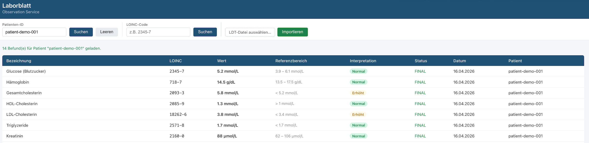

<!-- slide-id: a1494a10-93e0-463e-95b5-e443c8db0255 -->

# Claude Code in Practice

Basics · Demo · Scenario 1 · Scenario 2

---

<!-- slide-id: c40b6168-7c47-46f7-812c-a05801cb09c2 -->

## Agenda

- 🧱 Basics — Building blocks of Claude Code
- 🎬 Demo — Simpsons Agent live
- 🔬 Scenario 1 — Building a service from scratch
- 🔄 Scenario 2 — Spring Boot → Quarkus migration

---

<!-- slide-id: 26360f5f-ce45-475b-b1a9-9a9c074229a9 -->

<!-- _class: bg-gradient -->

## Basics

The building blocks of Claude Code

---

<!-- slide-id: 160c3531-d87c-4b30-bd2e-a5c7486db760 -->

## Basics

<h3>📄 agent.md</h3>

Defines the agent’s identity, goals, behavior, and operating instructions

<h3>🔔 Hooks</h3>

Run custom logic before or after specific Claude actions to automate checks and side effects

<h3>🔑 Permissions</h3>

Controls what the agent is allowed to access or execute — files, shell, network

---

<!-- slide-id: ce30c838-b0bd-4bfd-a4fb-a0fd091268e5 -->

## Basics (cont.)

<h3>🤖 Agents</h3>

Modular, reusable AI units with specific roles — compose complex workflows from focused components

<h3>🛠️ Skills</h3>

Packaged abilities the agent can invoke for specialized tasks beyond code

<h3>⚡ Slash Commands</h3>

Shortcut commands that invoke predefined actions via simple /text inputs

---

<!-- slide-id: 47f56628-b5ec-4edb-a6d2-748489a0f56b -->

<!-- _class: bg-gradient -->

## MCP

Model Context Protocol — connecting agents to external tools, data, and services

---

<!-- slide-id: b4c826c3-33f3-4dd1-a83f-3370b2441dcf -->

<h3>📦 The Harness</h3>

Packages all building blocks into one deployable unit

agent.md · Hooks · Permissions · Agents · Skills · Slash Commands · MCP

---

<!-- slide-id: 436bc48d-cd75-4122-a913-fc5a8b6fff8d -->

<!-- _class: bg-gradient -->

## Demo

Simpsons Agent

---

<!-- slide-id: d5862aa9-be97-4025-b024-e65aceee52ff -->

<!-- _class: bg-gradient -->

## Scenario 1

Building a Laboratory Observation Service with Quarkus

---

<!-- slide-id: 004f249f-5d10-4cc8-acb0-effe04b661db -->

## Scenario 1 — Description

- 🏗️ Quarkus-based Laboratory Observation Service
- 🤖 AI model: Claude Sonnet
- 📄 Specs-first, phased approach

---

<!-- slide-id: 91cc3acd-9f3c-4340-ac59-eca0b0e3964c -->

## Scenario 1 — Approach Details

- Model: Claude Sonnet
- Folder /specs with a zipped example service
- Brief technical requirements
- Functional requirements
- Phased: ask for PLAN.md before coding

---

<!-- slide-id: 7b4c185a-6d8a-4be3-93d1-5834a0f158f1 -->

## Scenario 1 — Result

<h3>✅ What Worked</h3>
<ul>
<li>First running vertical slice in ~20 mins</li>
<li>Rapid code generation</li>
<li>Clean initial structure</li>
</ul>

<h3>⚠️ What Didn’t</h3>
<ul>
<li>Omitted ‘extensions’ in phase 1</li>
<li>Model chose Jakarta Repositories over PanacheRepository</li>
<li>Tests failed due to StatelessSession limitations</li>
</ul>

---

<!-- slide-id: bbc072e4-77b8-4e2f-8a8d-8cff434702a4 -->

<h3>💡 Takeaway — Harness Engineering</h3>

Added explicit directive: always use PanacheRepository

→ Refining your specs and instructions for future runs is called "Feedback flywheel"

🔧 Small prompt adjustments → big reliability gains

---

<!-- slide-id: obs-service-diagram -->

## Scenario 1 — Observation Service

---

<!-- slide-id: 1390dcac-dbee-4041-9951-95f61a630889 -->

<!-- _class: bg-gradient -->

## Scenario 2

Spring Boot → Quarkus Migration

---

<!-- slide-id: 625149e3-02e2-4c90-9d0c-625f22b8b2e5 -->

## Scenario 2 — Description

- 🔄 Convert Spring Boot services to Quarkus
- 💻 Two services: person-service & contact-service
- 📁 Same specs-folder approach as Scenario 1

---

<!-- slide-id: 3d4b6378-2271-44f3-830d-e2b5f795d7ed -->

## Scenario 2 — Approach

<h3>📌 Person Service</h3>
<ul>
<li>Specs folder with example</li>
<li>example.zip = target service</li>
<li>Ideal reference material</li>
</ul>

<h3>📌 Contact Service</h3>
<ul>
<li>Simpler service to convert</li>
<li>Less reference material provided</li>
<li>Higher risk of model drift</li>
</ul>

---

<!-- slide-id: 182e87ea-533d-43d2-b88f-3a7527e0428b -->

## Scenario 2 — Result

<h3>✅ Person Service</h3>
<ul>
<li>Conversion worked well</li>
<li>Model had the target as example.zip</li>
<li>No surprise — ideal setup</li>
</ul>

<h3>⚠️ Contact Service</h3>
<ul>
<li>Code conversion worked</li>
<li>Tests failed repeatedly</li>
<li>Success after several round trips and approx 2h-3h</li>
</ul>

---

<!-- slide-id: 59c30764-8bc4-44b3-8642-4b93f6ae29ab -->

<h3>💡 Takeaway — Human in the Loop</h3>

Model excels at REST controller & persistence conversion

→ Final tests and edge cases still need manual human-in-the-loop fixes

